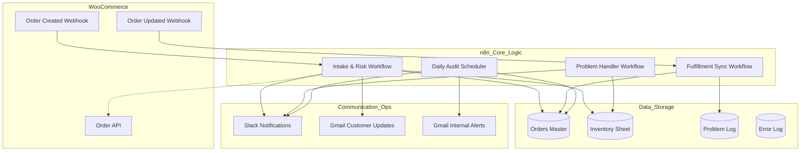
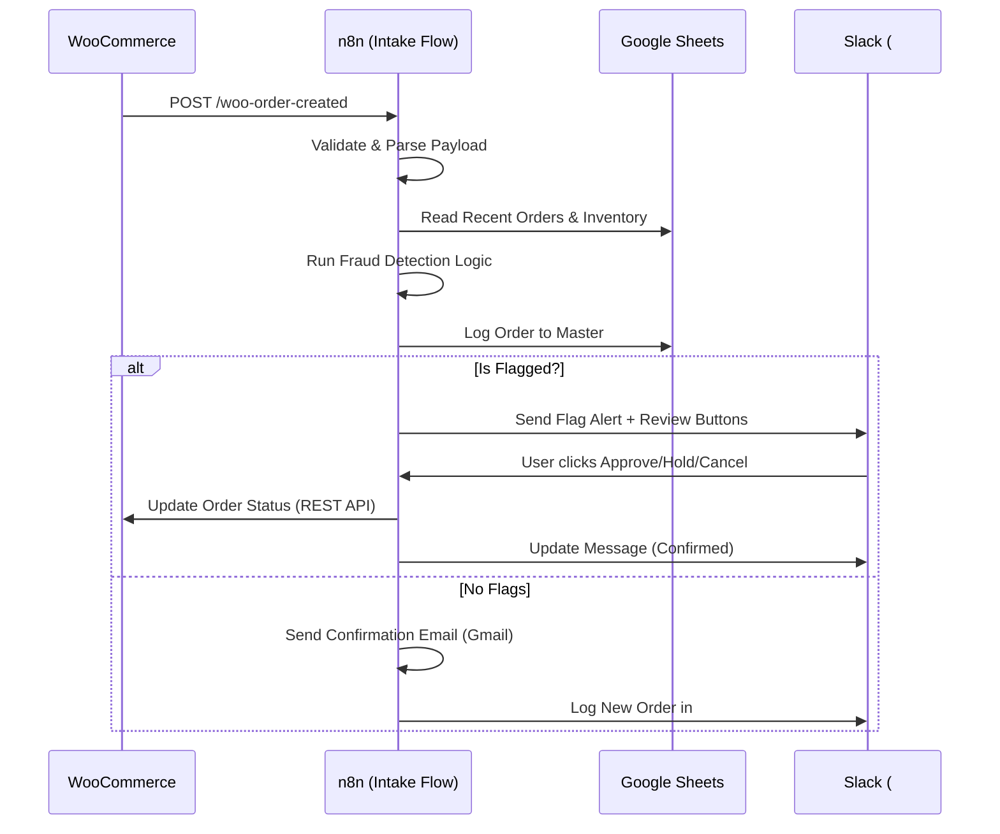
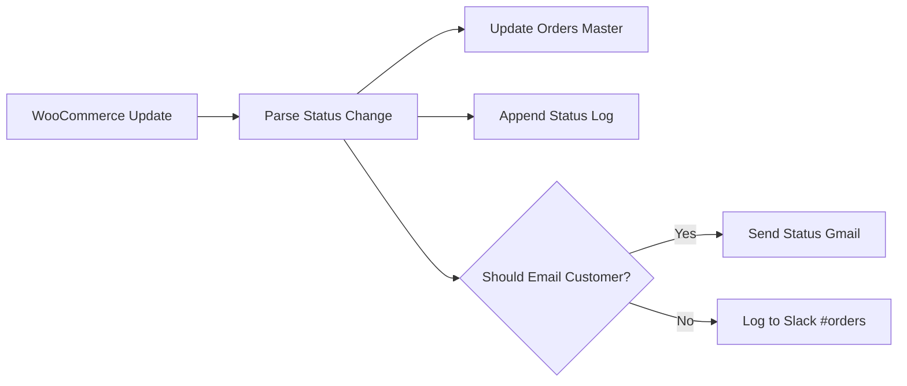
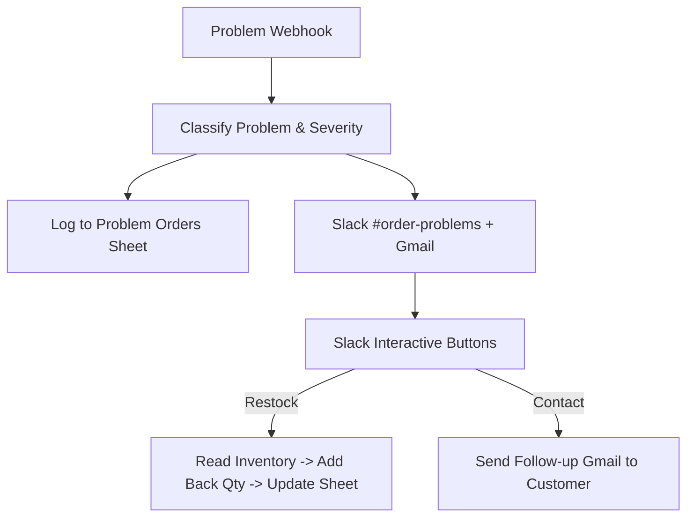

# System Architecture: WooCommerce Order Management

This document provides a technical deep dive into the n8n workflows, data structures, and operational logic that power the WooCommerce Order Management system.

---

## 🏗️ High-Level System Overview

The system is designed as a modular, event-driven architecture that sits between WooCommerce and back-office tools (Google Sheets, Slack, Gmail).

---

## 🔄 Workflow Breakdown

### 1. Order Intake & Risk Assessment (Flow 1)
Triggered by a `POST` request from WooCommerce when a new order is created.

**Fraud Logic Thresholds:**
*   **High Value:** Orders > $500.00.
*   **Velocity:** > 3 orders from same customer in 24h.
*   **Mismatches:** Billing country ≠ Shipping country.
*   **Guest Checkout:** Flagged for high-value orders with no registered customer account.

### 2. Fulfillment & Tracking (Flow 2)
Ensures the Master Sheet and customers are always in sync with WooCommerce status changes.

### 3. Problem Handling & Inventory Recovery (Flow 3)
Handles failed, cancelled, or refunded orders to prevent revenue loss and stock inaccuracies.

---

## 📊 Data Schema (Google Sheets)

### **Orders Master**
| Column | Description |
| :--- | :--- |
| `Order ID` | WooCommerce internal ID |
| `Status` | Current lifecycle state (Processing, Completed, etc.) |
| `Flagged` | YES/NO indicator from risk engine |
| `Logged At` | Timestamp of first intake |

### **Inventory**
| Column | Description |
| :--- | :--- |
| `SKU` | Unique product identifier |
| `Current Stock` | Real-time quantity available |
| `Reorder Threshold` | Minimum stock before alerting |

---

## 🚨 Error Handling Strategy

The system uses a **Global Error Trigger** linked to a secondary workflow.

1.  **Detection:** Every node in the main workflow is monitored.
2.  **Classification:**
    *   **CRITICAL:** Failures in Data Logging (Sheets) or Woo Updates.
    *   **WARNING:** Failures in Slack/Email notifications.
3.  **Response:**
    *   Logs the Error Stack Trace and Execution URL to the `Error Log`.
    *   Sends an urgent Slack message with a "View Execution" link for immediate debugging.
